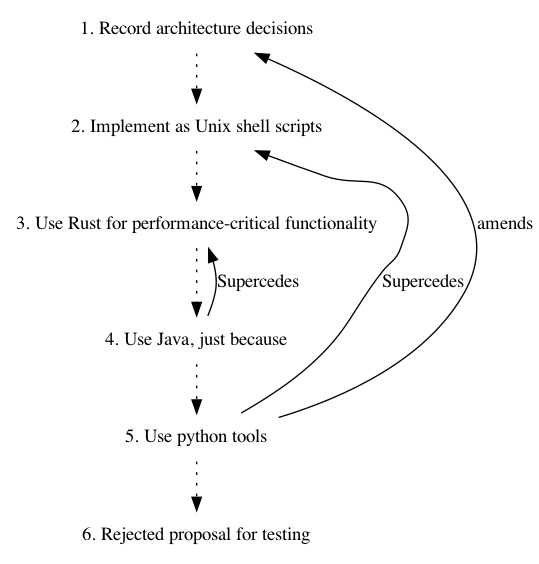

# Architecture

## Architecture Decision Records

We will record design decisions for the architecture to ensure we preserve the context of our
choices. These will be written in the format proposed in a
[blog post by Michael Nygard](https://cognitect.com/blog/2011/11/15/documenting-architecture-decisions.html)

Please see the [decisions directory](decisions/) for a list of all ADRs.

## Descision Records
* [1. Record architecture decisions](./decisions/0001-record-architecture-decisions.md)
* [2. Implement as Unix shell scripts](./decisions/0002-implement-as-unix-shell-scripts.md)
* [3. Use Rust for performance-critical functionality](./decisions/0003-use-rust-for-performance-critical-functionality.md)
* [4. Use Java, just because](./decisions/0004-use-java-just-because.md)
* [5. Use python tools](./decisions/0005-use-python-tools.md)
* [6. Rejected proposal for testing](./decisions/0006-Rejected-proposal-for-testing.md)

### Decision Graph

This is generated by a combination adr-tool (see below) and graphviz. Setup instructions [below](#generate-the-decision-graph).

### Tooling

We will use [adr-tools](https://github.com/npryce/adr-tools) to help manage the decisions (See [python tools](#alternative-python-tooling) for an alternative).

`brew install adr-tools`

Please ensure that this tool is used at the **root** of the repository only.

Documentation for tool is provided below as official repo is lacking.

#### Initialise a repository
`adr init` 

This will use default path of docs/adr for the records, a different path can be specified e.g. `adr init doc/architecture/decisions` as used by this repo.

#### Generate a new record

`adr new 'Decision to record'`

#### Generate a new record and supercede a previous record 
`adr new -s 4 Use Rust for performance-critical functionality`

#### List Records
`adr list`

#### Amend a previous record with link to later record
`adr link 5 amends 1 "Amended by"`

This will amend record number 1 with the message "Amended by [5. Use python tools](0005-use-python-tools.md)".
It will update record number 5 with "amends [1. Record architecture decisions](0001-record-architecture-decisions.md)"

#### Generate a Table of Contents
`adr generate toc`

#### Generate a graph 
`adr generate graph`

#### Upgrade documents to latest format
`adr upgrade-repository`

#### Show tool config information
`adr config`

### Alternative Python tooling
To allow windows users to interact with the ADR (or an alternative to bash) [adr-tools-python](https://bitbucket.org/tinkerer_/adr-tools-python/src/master/) can be used.
Replace space between adr and command in above example with a - e.g. `adr-list` in place of `adr list`.

### Generate a webpage to display documents
[adr-viewer](https://pypi.org/project/adr-viewer/) can be used to generate a basic webpage to display docs. See [docs](https://github.com/mrwilson/adr-viewer#usage) for usage. 
Example doc for this repo [here](../../index.html).

### Generate the decision graph
Install dependencies `brew install graphviz`, `pip install graphviz` or `pip install -r requirements.txt` in root of project. 
Run python script `python generate_decision_graph.py` to update ADR_Dependencies.png which is embedded in the 
